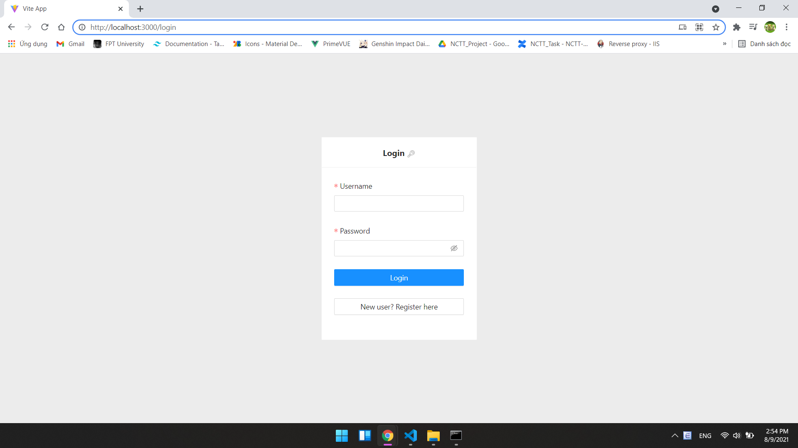
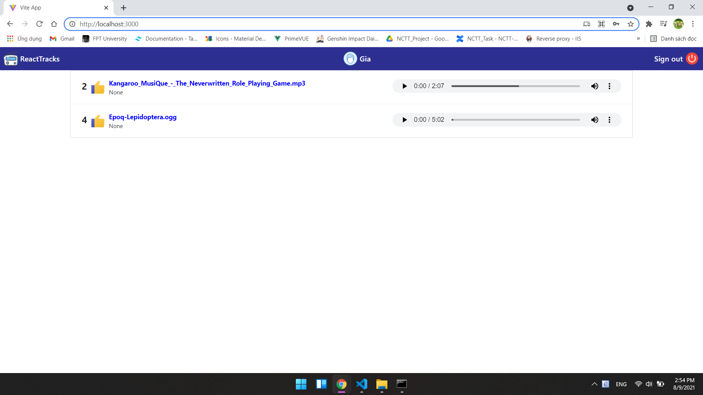

# Demo Jwt refresh token with asp.net core web api & reactJS
## This project resolve problems:
1. Cast object key in API response data to *camelCase*.
2. Use axios interceptor to add **Authorization** on each request header.
3. Use axios interceptor to auto convert to *camelCase* on each response data from api.
4. Demo Redux, Redux Toolkit
5. Demo jwt refresh token, server app base on [ASP.NET Core 3.1 API - JWT Authentication with Refresh Tokens | Jason Watmore's Blog](https://jasonwatmore.com/post/2020/05/25/aspnet-core-3-api-jwt-authentication-with-refresh-tokens)
6. Using Typescript
7. Use axios to call API.
## Prerequisites
* [Microsoft SQL Server](https://www.microsoft.com/en-us/sql-server/sql-server-downloads)
* [.NET 5.0 SDK and ASP.NET Core Runtime 5.0.8 or later](https://dotnet.microsoft.com/download/dotnet/5.0)
* [NodeJS](https://nodejs.org/)
## Update database
Install dotnet-ef to generate database from 'server app':
```bash
dotnet tool install –-global dotnet-ef
```
On folder `./server`, run command to create database:
```bash
dotnet ef database update --project relax-app
```
## Run server app
### Method 1:
On folder `./server` run file `run-server.bat`
### Method 2:
On folder `./server`, run command
```bash
dotnet run --project "relax-app"
```
## Run client app
Restore node_module with npm, on folder `jwt_refresh_token_demo`:
```bash
npm install
```
Run app on *dev mode*, on folder `jwt_refresh_token_demo`:
```bash
npm run dev
```
Open on browser http://localhost:3000/
## Account for test
Username: `sa`

Password: `123`
## Flow authentication
```bash
     +--------+                               +---------------+
     |        |--(A)- Authorization Request ->|   Resource    |
     |        |                               |     Owner     |
     |        |<-(B)-- Authorization Grant ---|               |
     |        |                               +---------------+
     |        |
     |        |                               +---------------+
     |        |--(C)-- Authorization Grant -->| Authorization |
     | Client |                               |     Server    |
     |        |<-(D)----- Access Token -------|               |
     |        |                               +---------------+
     |        |
     |        |                               +---------------+
     |        |--(E)----- Access Token ------>|    Resource   |
     |        |                               |     Server    |
     |        |<-(F)--- Protected Resource ---|               |
     +--------+                               +---------------+
```
References: [rfc6749](https://datatracker.ietf.org/doc/html/rfc6749)
## Screenshots


